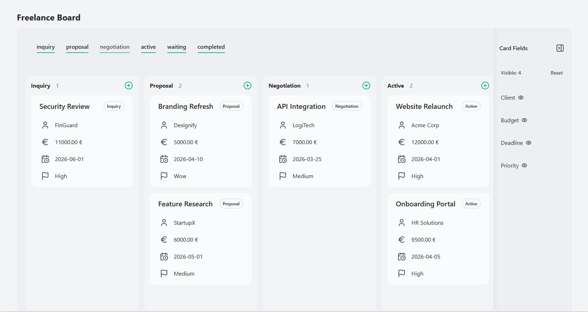
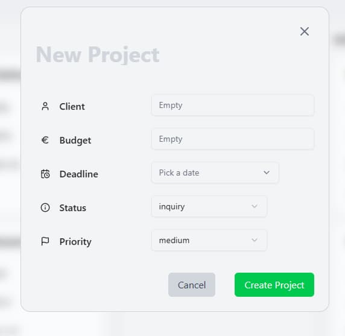
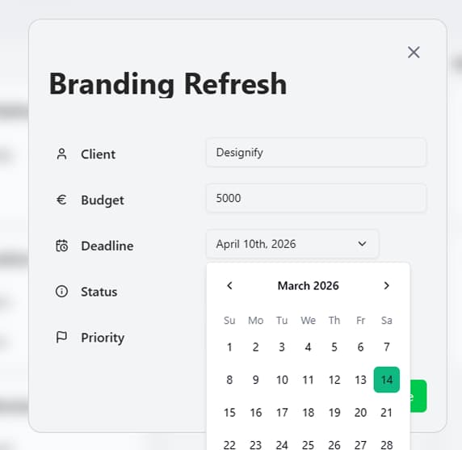
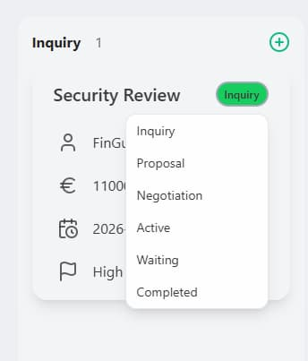
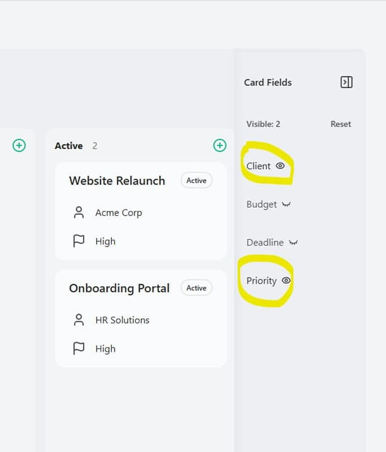
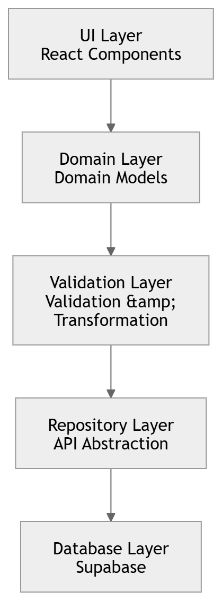

# Freelance Kanban Board

A minimalism Kanban Board for managing freelancing projects with minimum interaction.

## 💿 Live Demo

## 🚀 Features

- Manage projects using a minimalist Kanban board
- Toggle project statuses to filter visible columns
- Show or hide project details via a global sidebar
- Local storage persistence for demo mode
- Full CRUD operations with Supabase for authenticated users

## 🖼️ Screenshots

### Board Overview

Minimal Kanban board with multiple columns and task cards.

---

### Create and Edit Projects

  
  

Create new projects and edit existing ones via a modal form.

---

### Workflow Interaction

  
  

Quickly change project status or toggle visible card fields.

## 🛠️ Tech Stack

## 🏗️ Architecture

  

The project follows a layered architecture separating UI logic, domain models and data access.

### Layers

**UI Layer**

- React components and user interaction

**Domain Layer**

- Core application models independent from the database

**Validation Layer**

- Ensures valid domain data before persistence

**Repository Layer**

- Abstraction between UI and external APIs

**Database Layer**

- Handles Supabase communication

## 💡 Motivation

I built this project to deepen my skills in Next.js. I chose a freelance Kanban board because I often encountered issues with tools like Notion, where boards quickly become overloaded with nested information. My goal was to provide a minimalistic information dashboard that remains easy to scan and highlights only the most critical details.

## 📫 Contact

- E-Mail: leonid.budkov@gmail.com
